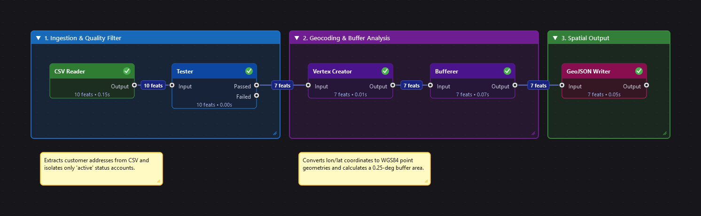

# open-FME Workbench 🌍⚡
### The Open-Source Spatial & Tabular ETL Pipeline Automation Platform for Python

[](LICENSE)
[](https://www.python.org/)
[](https://www.riverbankcomputing.com/software/pyqt/)
[](https://pola.rs/)
[](https://geopandas.org/)
[](CONTRIBUTING.md)

**open-FME** is a modern, high-performance, visual node-based ETL (Extract, Transform, Load) and spatial data integration platform built for Python — inspired by Safe Software's **FME Workbench**.

It empowers GIS analysts, data engineers, and researchers to design, debug, and execute complex spatial data pipelines visually without restrictive commercial licenses, combining the raw speed of **Polars** with the geospatial vector power of **GeoPandas**, **Shapely**, and **PyProj**.

---

## 📸 Visual Pipeline Flowchart & Architecture

<p align="center">
  
</p>

*Figure 1: Live visual DAG pipeline flowchart in open-FME — CSV Reader ➔ Tester ➔ Vertex Creator ➔ Bufferer ➔ GeoJSON Writer with live feature count badges, color-coded bookmarks, and sticky notes.*

```text
 ┌────────────────────────────────────────────────────────────────────────┐
 │                         open-FME Workbench (PyQt6)                     │
 ├───────────────────┬──────────────────────────────────┬─────────────────┤
 │ Transformer       │       Visual Canvas (DAG)        │ Node Properties │
 │ Gallery           │                                  │ Inspector       │
 │                   │   [CSVReader]                    ├─────────────────┤
 │ ├─ Readers        │        │ (Output)                │ Live Parameter  │
 │ ├─ Attributes     │        ▼                         │ Editor          │
 │ ├─ Spatial        │     [Tester]                     │ (Expressions,   │
 │ ├─ Overlay        │        │ (Passed)                │  Tolerances,    │
 │ ├─ Geoprocessing  │        ▼                         │  CRS, Files)    │
 │ ├─ Raster         │  [VertexCreator]                 │                 │
 │ └─ Writers        │        │ (Output)                │                 │
 │                   │        ▼                         │                 │
 │                   │    [Bufferer] ──► [GeoJSONWriter]│                 │
 ├───────────────────┴──────────────────────────────────┴─────────────────┤
 │              Visual Data Inspector (Map View & Tabular View)           │
 └────────────────────────────────────────────────────────────────────────┘
                                    │
                                    ▼
       ┌─────────────────────────────────────────────────────────┐
       │             open-FME Dual Execution Engine              │
       │                                                         │
       │   ⚡ Polars (Tabular)         🗺️ GeoPandas + Shapely     │
       │   - Microsecond filters       - Vector topology         │
       │   - High-speed grouping       - Buffers, clips, overlays│
       │   - Memory-efficient joins    - CRS reprojection        │
       └─────────────────────────────────────────────────────────┘
```

---

## 🌟 Key Features

### 1. 🎨 Visual DAG Pipeline Builder
- **Node-Based Canvas**: Drag and drop Readers, Transformers, and Writers. Connect ports using cubic Bezier spline wires.
- **Multi-Port Intelligent Routing**: Nodes feature dedicated conditional ports (e.g. `Tester` routes to `Passed` and `Failed`; `DuplicateFilter` routes to `Unique` and `Duplicate`; `Clipper` routes to `Inside` and `Outside`).
- **Live Feature Counting**: Real-time feature count badges on nodes and connection wires (e.g., `1,250 feats`).
- **FME-Style Quick-Add (`Spacebar` / `Tab`)**: Press `Spacebar` anywhere on the canvas to pop up a fuzzy-search dialog right at your mouse cursor.
- **Canvas Controls**: Smooth zooming with mouse wheel, panning with Middle-Mouse or `Alt + Drag`, and box multi-selection.

### 2. ⚡ Blazing Dual Engine: Polars + GeoPandas
- **Polars Tabular Core**: Columnar, SIMD-accelerated attribute filtering, sorting, expressions, string handling, and deduplication.
- **GeoPandas & Shapely GIS Core**: Coordinate transformations, spatial joins, buffering, overlay operations, polygon area, line length, bounding boxes, and geometry generation.
- **Unified `FeatureDataset`**: Zero-copy conversions and effortless bridging between attribute frames and spatial geometry layers.

### 3. 🔍 Built-in Visual Data Inspector
- **Tabular Inspector**: Rapid table preview displaying record attributes, column data types, row numbers, and live search filtering.
- **2D Spatial Vector Map**: Real-time canvas rendering of Shapely geometries (**Points**, **LineStrings**, **Polygons**, **MultiPolygons**) with live coordinate tracking under cursor, zoom/pan, and reset view.
- **Schema & Extents**: Instant display of bounding box extents, CRS details, feature counts, and field definitions.

### 4. ⌨️ Professional Editing & Undo / Redo
- **Unlimited Undo / Redo (`Ctrl+Z` / `Ctrl+Y`)**: Safely undo and redo adding nodes, deleting nodes/wires, connecting ports, and moving items.
- **Full Clipboard Suite**:
  - `Ctrl + C`: Copy selected nodes and their internal wiring.
  - `Ctrl + X`: Cut selected items.
  - `Ctrl + V`: Paste nodes with fresh unique IDs and automatic positional offsets.
  - `Ctrl + D`: Instantly duplicate selected items.
- **Quick Selection**: `Ctrl + A` (Select All), `Escape` (Deselect All), `Delete` / `Backspace` (Remove selection).

### 5. 📂 Drag-and-Drop Data Ingestion
- Drag spatial and tabular files (`.csv`, `.shp`, `.geojson`, `.xlsx`, `.parquet`, `.tif`, `.fpy`) directly from Windows File Explorer / desktop onto the canvas.
- Automatically creates and configures the corresponding Reader node at your cursor location.

### 6. ⚡ FME Translation Generator (`Ctrl+G`) & Readers/Writers
- **Generate Workspace (`Ctrl+G`)**: Prompts for source Reader format/dataset and destination Writer format/dataset, automatically instantiating and connecting them on the canvas.
- **Dedicated Readers & Writers Menus (`Ctrl+Alt+R` / `Ctrl+Alt+W`)**: Quick dialogs for adding new source and target datasets.

### 7. 🚀 Feature Caching & Partial DAG Runs
- **Run to This**: Right-click any node to execute only upstream dependencies up to that node and inspect intermediate cached features.
- **Run From This**: Reuses cached memory datasets from upstream nodes and executes only downstream nodes, accelerating iterative pipeline authoring.
- **Visual Caching Status**: Node header status indicators and cached feature feature counts.

### 8. 🐍 Custom Python Scripting (`PythonCaller`)
- Embed custom Python logic directly within any pipeline step using the `PythonCaller` transformer.
- Full access to incoming features as `polars.DataFrame` or `geopandas.GeoDataFrame`.

### 9. 🚀 Headless CLI Automation & CI/CD
- Workspaces save into portable `.fpy` (JSON-based) files.
- Execute headless in automated batch pipelines, Windows Task Scheduler, cron, Airflow, or Docker:
  ```bash
  python -m openfme.cli run workspace.fpy
  ```
- Override node parameters dynamically at runtime:
  ```bash
  python -m openfme.cli run workspace.fpy --param CSVReader.file_path="C:/data/input.csv"
  ```

### 10. 💡 Interactive Hover Descriptions & Live Tooltips
- **Canvas Nodes**: Hovering over any transformer on the canvas reveals a rich card showing:
  - Transformer Name and Type
  - Functional Category badge
  - Detailed "What it does" description
  - Live execution status, processed feature counts, and execution duration in seconds.
- **Connection Ports**: Hovering over any input or output port reveals port direction and purpose (e.g. `Inside` vs `Outside`, `Matched` vs `NotMatched`).
- **Transformer Gallery & Quick-Add**: Hovering over library items in the tree palette or browsing via `Spacebar` displays interactive descriptions and live preview cards.

---

## 📥 Installation

### Prerequisites
- Python 3.10, 3.11, 3.12, 3.13, or 3.14
- Operating System: Windows, macOS, or Linux

### 1. Clone the Repository
```bash
git clone https://github.com/your-username/open-fme.git
cd open-fme
```

### 2. Set up a Virtual Environment
```bash
# Windows
python -m venv venv
venv\Scripts\activate

# macOS / Linux
python3 -m venv venv
source venv/bin/activate
```

### 3. Install Dependencies
```bash
pip install -r requirements.txt
pip install -e .
```

### 4. Launch open-FME Workbench
```bash
# Direct Python launcher
python main.py

# Or using the Windows Batch launcher
run_open_fme.bat

# Or using the installed CLI command
open-fme-gui
```

---

## 🏃 Quickstart: Building Your First Pipeline in 3 Minutes

1. **Launch the Workbench**: Run `python main.py` or double-click `run_open_fme.bat`.
2. **Add a Reader**:
   - Drag `sample_data/customers.csv` directly onto the canvas, or press `Spacebar` and type `CSVReader`.
3. **Filter Records**:
   - Press `Spacebar`, type `Tester`, and press `Enter`.
   - Connect `CSVReader.Output` ➔ `Tester.Input`.
   - In the **Node Properties** dock on the right, set:
     - `attribute` = `status`
     - `operator` = `=`
     - `test_value` = `active`
4. **Create Geometries**:
   - Press `Spacebar`, select `VertexCreator`.
   - Connect `Tester.Passed` ➔ `VertexCreator.Input`.
   - Set `x_attribute` = `lon`, `y_attribute` = `lat`, `crs` = `EPSG:4326`.
5. **Generate Buffers**:
   - Add a `Bufferer` node.
   - Connect `VertexCreator.Output` ➔ `Bufferer.Input`.
   - Set `buffer_distance` = `0.05` (degrees or project CRS units).
6. **Write Output**:
   - Add a `GeoJSONWriter` node.
   - Connect `Bufferer.Output` ➔ `GeoJSONWriter.Input`.
   - Set `file_path` = `sample_data/active_customers_buffered.geojson`.
7. **Run**:
   - Press `F5` or click **▶ Run** on the toolbar.
   - Watch features stream through the pipeline.
   - Click on the `Bufferer` node to view the resulting polygon geometries in the **Visual Data Inspector** map and table below!

> 💡 **Instant Templates**: You can also load this exact pipeline directly by navigating to **File ➔ Predefined Workflows ➔ Customer Spatial Profiling & Buffering** or picking it from the **Start** tab! (Refer to the **[Visual Pipeline Flowchart](#-visual-pipeline-flowchart--architecture)** above for the complete visual diagram).

---

## 📦 Transformer Catalog (150+ Nodes — FME, GDAL & SAGA GIS)

### 📥 Readers (Inputs)
| Node | Supported Formats | Description |
| :--- | :--- | :--- |
| `GeoTIFFReader` / `RasterReader` | `.tif`, `.tiff`, `.geotiff` | Reads raster datasets, DEMs, multispectral imagery, and grid elevations |
| `CSVReader` | `.csv`, `.tsv`, `.txt` | High-speed tabular reader with automatic Polars schema inference |
| `GeoJSONReader` | `.geojson`, `.json` | Reads standard vector features, geometries, and attribute properties |
| `ShapefileReader` | `.shp` | ESRI Shapefile reader with coordinate reference system detection |
| `ExcelReader` | `.xlsx`, `.xls` | Microsoft Excel workbook reader with sheet selection |
| `ParquetReader` | `.parquet` | Columnar Apache Parquet and GeoParquet reader |
| `FeatureReader` | Dynamic file path attribute | Reads vector or tabular datasets dynamically at runtime inside the pipeline |

### 📤 Writers (Outputs)
| Node | Supported Formats | Description |
| :--- | :--- | :--- |
| `GeoTIFFWriter` / `RasterWriter` | `.tif`, `.tiff` | Exports raster datasets, DEMs, or burned/vectorized spatial features to GeoTIFF |
| `GeoJSONWriter` | `.geojson` | Exports vector geometries and attributes to GeoJSON |
| `ShapefileWriter` | `.shp` | Exports spatial layers to ESRI Shapefile with attribute DBF table |
| `CSVWriter` | `.csv` | High-speed tabular CSV export |
| `ExcelWriter` | `.xlsx` | Formatted Excel workbook export |
| `ParquetWriter` | `.parquet` | High-performance Parquet / GeoParquet columnar export |

### ✂️ Overlay & Geoprocessing (FME & GDAL)
| Node | Ports | Description |
| :--- | :--- | :--- |
| `AreaOnAreaOverlayer` | `Input` ➔ `Output` | Full polygon overlay calculating all geometric fragments and tracking `_overlaps` count (FME / ArcGIS Union) |
| `LineOnLineOverlayer` | `Input` ➔ `Lines`, `Points` | Splits lines at crossings and detects intersection node points (FME / SAGA) |
| `PointOnLineOverlayer` | `Point`, `Line` ➔ `Output` | Snaps or tests points against lines, calculating `_distance_to_line` (FME) |
| `Clipper` | `Candidate`, `Clipper` ➔ `Inside`, `Outside` | Spatial clipping of Candidate features by boundary polygon |
| `PointOnAreaOverlayer` | `Point`, `Area` ➔ `PointOutput`, `AreaOutput` | Point-in-polygon spatial join transferring attributes |
| `LineOnAreaOverlayer` | `Line`, `Area` ➔ `LineOutput`, `AreaOutput` | Splits lines by polygons with attribute inheritance |
| `Intersector` | `Input` ➔ `Segments`, `Nodes` | Splits lines at crossing points, generating intersection nodes |
| `Snapper` | `Input` ➔ `Output` | Snaps vertices within specified distance tolerance |
| `Dissolver` | `Input` ➔ `Output` | Merges geometries sharing common attribute values |
| `Aggregator` | `Input` ➔ `Output` | Combines multiple features into multi-part geometries |
| `Deaggregator` | `Input` ➔ `Output` | Explodes multi-part geometries into individual single-part features |
| `Densifier` | `Input` ➔ `Output` | Adds intermediate vertices along lines/polygons at a set interval (FME / GDAL) |
| `Generalizer` | `Input` ➔ `Output` | Simplifies geometries using the Douglas-Peucker algorithm |
| `DuplicateRemover` | `Input` ➔ `Unique`, `Duplicate` | Deduplicates features by key attribute or exact geometry coordinates |

### 🧭 Spatial Relations & Network Topology (FME & SAGA)
| Node | Ports | Description |
| :--- | :--- | :--- |
| `TopologyBuilder` | `Input` ➔ `Edges`, `Nodes` | Builds topological networks from lines, generating from/to nodes and node degrees |
| `NetworkTopologyCalculator` | `Input` ➔ `Output` | Computes graph connectivity, assigning connected component network IDs (`_network_id`) |
| `DelaunayTriangulator` | `Input` ➔ `Triangles` | Computes Delaunay triangulation from input points, returning triangular polygons |
| `SpatialRelator` | `Base`, `Candidate` ➔ `Output` | Evaluates topological predicates (`intersects`, `contains`, `within`, `touches`) |
| `NeighborFinder` | `Base`, `Candidate` ➔ `Matched`, `Unmatched` | Finds nearest neighbor with calculated distance in CRS units |
| `SpatialFilter` | `Base`, `Candidate` ➔ `Passed`, `Failed` | Filters features satisfying spatial predicates against boundary layers |
| `Matcher` | `Input` ➔ `Matched`, `SingleMatched` | Identifies exact geometric duplicate features |

### 📐 Geometry Creation & Transformations
| Node | Description |
| :--- | :--- |
| `AreaBuilder` | Polygonizes connected line segments into closed area polygons (`Area` / `Incomplete` ports) |
| `DonutBuilder` | Assembles outer shell polygons with internal hole rings into donut polygons |
| `LineJoiner` / `LineCombiner` | Merges contiguous line segments sharing endpoints into single continuous lines |
| `VertexRemover` | Removes specified vertices (first, last, or by index) from line or polygon geometries |
| `3DForcer` | Sets geometry dimension to 3D by assigning an elevation $Z$ coordinate from fixed value or attribute |
| `Affiner` | Applies general 2D affine transformation matrix ($X' = ax + by + x_{off}, Y' = dx + ey + y_{off}$) |
| `Offsetter` | Offsets lines and points by $\Delta X$ and $\Delta Y$ distance |
| `CoordinateConcatenator` | Formats all vertex coordinates into a delimited string attribute (e.g. `x1,y1 x2,y2`) |
| `GeometryCoercer` | Converts geometries between types (e.g. Polygons to boundary lines, points to bounding boxes) |
| `GeometryReplacer` | Replaces feature geometry from a WKT or GeoJSON attribute string |
| `CenterLineReplacer` | Calculates medial axis / centerline approximation for polygon geometries |
| `CenterPointReplacer` | Replaces geometry with its centroid or representative interior point |
| `Extruder` | Extrudes 2D polygon footprints vertically by height, calculating 3D bounds and volume |
| `TINGenerator` | Builds Triangulated Irregular Network (TIN) surface triangles from 3D point features |
| `VertexCreator` | Creates Point geometries from coordinate attributes ($X$, $Y$, $Z$) |
| `Reprojector` | Transforms coordinates between coordinate reference systems (e.g. EPSG:4326 ⇄ EPSG:3857) |
| `Bufferer` | Generates buffer zones around points, lines, or polygons with customizable resolution |
| `CoordinateSystemSetter` | Assigns or overrides CRS metadata without modifying coordinate numbers |
| `GeometryValidator` | Validates OGC compliance, repairs self-intersections (`Valid` / `Invalid` ports) |
| `BoundingBoxAccumulator` | Constructs single cumulative bounding box rectangle for entire dataset |
| `ConvexHullAccumulator` | Computes cumulative convex hull polygon enclosing all features |
| `VoronoiDiagrammer` | Constructs Thiessen / Voronoi polygon tessellations from points |
| `AreaCalculator` / `LengthCalculator` | Computes polygon areas and line lengths in projection units |

### 📊 Attribute, Database & Table Handling (FME, GDAL & SQLite)
| Node | Description |
| :--- | :--- |
| `Joiner` | Fast tabular join across Left and Right tables (`left`, `inner`, `full`) |
| `InlineQuerier` | Embedded SQLite SQL query engine executing arbitrary SQL across input tables in-memory |
| `SQLExecutor` | Executes SQL queries against external SQLite or PostGIS database connections |
| `ListExploder` | Explodes delimited string or list attributes into individual feature rows |
| `ListBuilder` | Groups features and compiles attribute values into delimited list strings |
| `StringSearcher` | Regex pattern matcher extracting capture groups into attributes (`Matched` / `NotMatched`) |
| `StringFormatter` | Formats text using dynamic template expressions (e.g. `{first_name} {last_name}`) |
| `DateTimeCalculator` | Calculates day differences and date additions/subtractions across attributes |
| `XMLFlattener` | Flattens XML elements from files, strings, or attributes into tabular records |
| `PythonCreator` | Generates synthetic feature streams from custom Python generator code |
| `TestFilter` / `AttributeFilter` | Multi-port conditional routers based on expressions or attribute values |
| `AttributeManager` | All-in-one attribute editor: create, rename, cast, calculate, and drop fields |
| `StatisticsCalculator` | Computes summary metrics: min, max, mean, sum, count, standard deviation |

### 🛰️ Raster & Terrain Analysis (FME, GDAL & SAGA GIS)
| Node | Description |
| :--- | :--- |
| `PointOnRasterValueExtractor` | Samples raster pixel values at vector point locations (FME / GDAL `gdallocationinfo` / SAGA `Add Grid Values to Points`) |
| `SlopeCalculator` | Calculates topographic slope in degrees or percent from a DEM raster (FME / GDAL `gdaldem slope` / SAGA `Slope`) |
| `AspectCalculator` | Calculates compass aspect in degrees (0–360°) from a DEM (FME / GDAL `gdaldem aspect` / SAGA `Aspect`) |
| `HillshadeGenerator` | Generates 8-bit shaded relief hillshade from a DEM (FME / GDAL `gdaldem hillshade` / SAGA `Analytical Hillshading`) |
| `ContourGenerator` | Extracts vector contour LineStrings from a DEM raster at customizable elevation intervals (FME / GDAL `gdal_contour` / SAGA) |
| `RasterExpressionEvaluator` | Evaluates map algebra expressions on raster bands e.g. NDVI `(A - B) / (A + B)` (FME / GDAL `gdal_calc.py` / SAGA `grid_calculus`) |
| `RasterCellValueReplacer` | Reclassifies or replaces cell values within a given range (FME / SAGA `Reclassify Grid Values`) |
| `RasterCellValueRounder` | Rounds raster cell values to specified decimal places or integers |
| `RasterConvolver` | Applies 2D convolution filters: 3x3 smoothing, Gaussian blur, Sobel, Laplacian edge detection, and sharpen |
| `RasterDEMGenerator` | Interpolates regular DEM grid from vector point features using IDW or Nearest Neighbor (FME / GDAL `gdal_grid` / SAGA) |
| `RasterToPointCoercer` | Converts raster cells into vector Point features with coordinates and pixel value attributes |
| `ZonalStatisticsCalculator` | Calculates zonal statistics (min, max, mean, sum, count) per polygon from a raster (SAGA `shapes_grid` / FME) |
| `RasterDiffer` | Computes pixel-by-pixel difference between two rasters ($A - B$) (FME / GDAL `gdalcompare`) |
| `RasterResampler` | Resamples raster cell size and resolution using nearest, bilinear, or cubic methods (FME / GDAL `gdalwarp` / SAGA) |
| `SurfaceDraper` | Drapes 2D vector geometries onto a DEM raster by interpolating $Z$ elevations at each vertex (FME `SurfaceDraper`) |
| `RasterMosaicker` | Mosaics multiple raster files into a single seamless output raster (FME / GDAL `gdal_merge.py` / SAGA) |
| `RasterRGBCombiner` | Combines separate Red, Green, and Blue single-band rasters into an RGB 3-band GeoTIFF |
| `RasterBandSelector` | Extracts a single band from a multi-band raster into a 1-band GeoTIFF |
| `RasterTiler` | Cuts a raster into regular grid tiles of specified pixel dimensions |
| `GDALRasterize` | Burns vector features and attribute values into a raster grid (GDAL `gdal_rasterize` / SAGA `Shapes to Grid`) |
| `GDALProximity` | Computes Euclidean distance-to-feature raster from target pixel values (GDAL `gdal_proximity.py` / SAGA) |
| `GDALInfo` | Comprehensive raster metadata inspection: CRS, bounds, dimensions, nodata, and statistics (GDAL `gdalinfo`) |
| `GDALTranslate` | Converts raster formats, subsets bounding extents, and rescales pixel values (GDAL `gdal_translate`) |
| `GDALWarp` | Reprojects and resamples raster layers to a target Coordinate Reference System (GDAL `gdalwarp`) |
| `SAGATerrainAnalysis` | Topographic morphometry: Slope, Aspect, Terrain Ruggedness Index (TRI), Topographic Position Index (TPI), and Roughness (SAGA `ta_morphometry`) |
| `RasterExtentsCoercer` | Extracts bounding polygon envelope from GeoTIFF raster files |
| `RasterPropertyExtractor` | Reads raster dimensions, pixel resolution, band count, bounds, and CRS |
| `RasterStatisticsCalculator` | Calculates min, max, mean, and standard deviation per raster band |
| `RasterToPolygonCoercer` | Vectorizes raster pixel zones into vector polygon features |

### ⚙️ Automation & Scripting
| Node | Description |
| :--- | :--- |
| `Creator` | Generates initial synthetic features to trigger workflows |
| `Terminator` | Halts execution immediately with an error log when an invalid feature arrives |
| `Logger` | Logs feature schemas and attribute summaries to the execution console |
| `HTTPCaller` | Sends HTTP REST requests (GET, POST, PUT, DELETE) and parses responses |
| `JSONFragmenter` | Explodes JSON arrays into individual feature records |
| `PythonCaller` | Executes custom Python code with direct Polars & GeoPandas access |
| `SystemCaller` | Executes shell commands, CLI utilities, or batch scripts |
| `OGRInfo` | Inspects vector layers: geometry types, feature count, CRS, bounds, and fields (GDAL `ogrinfo`) |
| `OGR2OGR` | Universal vector transformation, reprojection, SQL where filtering, and simplification (GDAL `ogr2ogr`) |

---

## ⌨️ Keyboard Shortcuts & Canvas Operations

| Shortcut | Action |
| :--- | :--- |
| `Ctrl + G` | **Generate Workspace**: Format-to-format translation generator wizard |
| `Ctrl + Alt + R` | **Add Reader**: Source dataset selector dialog |
| `Ctrl + Alt + W` | **Add Writer**: Destination dataset selector dialog |
| `Right-Click Node` | **Run to This / Run From This** (Feature Caching) & Inspect Cached Data |
| `Ctrl + B` | **Insert Bookmark**: Add visual container enclosing selected nodes |
| `Spacebar` or `Tab` | Open Quick-Add Transformer search dialog at cursor |
| `F5` | Run entire workspace pipeline |
| `Ctrl + Z` | Undo last canvas / node action |
| `Ctrl + Y` | Redo action |
| `Ctrl + C` | Copy selected nodes and internal wires |
| `Ctrl + X` | Cut selected nodes |
| `Ctrl + V` | Paste copied nodes with unique IDs |
| `Ctrl + D` | Instantly duplicate selected nodes |
| `Ctrl + A` | Select all nodes and wires |
| `Escape` | Deselect all |
| `Delete` / `Backspace` | Delete selected nodes or connection wires |
| `Mouse Wheel` | Smooth zoom in / zoom out |
| `Middle Click + Drag` | Pan canvas |
| `Alt + Left Click + Drag` | Pan canvas (laptop touchpad friendly) |

---

## 💻 Headless CLI Automation

Workspaces saved in open-FME (`.fpy` format) can be executed in headless environments without a display:

### Basic Execution
```bash
python -m openfme.cli run sample_data/sample_workflow.fpy
```

### Parameter Overrides at Runtime
You can override parameters of any transformer without opening the UI:
```bash
python -m openfme.cli run sample_data/sample_workflow.fpy \
  --param CSVReader.file_path="/data/in/january.csv" \
  --param Bufferer.buffer_distance=0.10 \
  --param GeoJSONWriter.file_path="/data/out/buffered.geojson"
```

---

## 🧩 Developer Guide: Writing Custom Transformers

open-FME makes extending the platform trivial. Anyone can create and register a new custom node in ~15 lines of Python:

```python
from pyfme.engine.nodes.base import (
    BaseNode, NodeCategory, Port, PortType, ParameterDef, ParameterType
)
from pyfme.engine.dataset import FeatureDataset
from pyfme.engine.registry import NodeRegistry
import polars as pl

@NodeRegistry.register
class HighValueFilter(BaseNode):
    node_type = "HighValueFilter"
    category = NodeCategory.ATTRIBUTE
    description = "Filters transactions exceeding a minimum amount"

    @classmethod
    def get_input_ports(cls):
        return [Port("Input", PortType.INPUT)]

    @classmethod
    def get_output_ports(cls):
        return [
            Port("Passed", PortType.OUTPUT),
            Port("Failed", PortType.OUTPUT),
        ]

    @classmethod
    def get_parameter_defs(cls):
        return [
            ParameterDef("min_amount", ParameterType.FLOAT, default=1000.0, description="Minimum threshold"),
        ]

    def execute(self, inputs, params, context=None):
        ds = inputs.get("Input")
        if ds is None or ds.is_empty():
            return {"Passed": FeatureDataset(), "Failed": FeatureDataset()}

        threshold = float(params.get("min_amount", 1000.0))
        df = ds.to_polars()
        
        passed_df = df.filter(pl.col("amount") >= threshold)
        failed_df = df.filter(pl.col("amount") < threshold)

        return {
            "Passed": FeatureDataset.from_polars(passed_df),
            "Failed": FeatureDataset.from_polars(failed_df),
        }
```

Once saved, open-FME **automatically discovers and registers** your new node:
- Instantly visible in the **Transformer Gallery** palette.
- Searchable via the **Quick-Add (`Spacebar`)** menu.
- Fully supported in **Headless CLI** runs.

---

## 🗺️ Project Structure

```text
open-fme/
├── main.py                     # Primary desktop application entry point
├── run_open_fme.bat            # Windows 1-click launcher script
├── run_pyfme.bat               # Backward-compatible batch launcher
├── requirements.txt            # Python dependencies
├── pyproject.toml              # PEP 518/621 packaging metadata
├── LICENSE                     # MIT License
├── CONTRIBUTING.md             # Contribution guidelines & architecture guide
├── README.md                   # Project documentation
├── test_edit_undo_redo.py      # Automated regression test suite
├── openfme/                    # Package namespace wrapper
│   ├── __init__.py
│   └── cli.py                  # Headless CLI entry point
├── pyfme/                      # Core implementation
│   ├── cli.py                  # CLI engine
│   ├── engine/                 # ETL processing engine
│   │   ├── dataset.py          # Unified Polars/GeoPandas FeatureDataset
│   │   ├── graph.py            # DAG workflow graph & serialization
│   │   ├── registry.py         # Dynamic node registry
│   │   ├── runner.py           # Topological execution engine
│   │   └── nodes/              # Node definitions
│   │       ├── readers.py      # Spatial & tabular readers
│   │       ├── writers.py      # Spatial & tabular writers
│   │       └── transformers/   # 100+ GIS & attribute transformers
│   └── ui/                     # Desktop GUI (PyQt6)
│       ├── main_window.py      # Main application window
│       ├── styles.py           # Modern dark UI theme tokens
│       ├── quick_search.py     # Spacebar quick-add transformer popup
│       ├── canvas/             # Interactive node-graph canvas
│       ├── inspector/          # Visual data inspector (table & map)
│       ├── palette/            # Transformer gallery dock
│       └── properties/         # Dynamic parameter property editor
└── sample_data/                # Sample datasets & demo pipelines
    ├── customers.csv           # Sample customer location data
    ├── regions.geojson         # Sample boundary polygons
    └── sample_workflow.fpy     # End-to-end spatial ETL pipeline
```

---

## 🤝 Contributing

Contributions are warmly welcomed! Whether you want to add new transformers, improve performance, or enhance the UI, check out our [Contributing Guide](CONTRIBUTING.md) to get started.

1. Fork the Project
2. Create your Feature Branch (`git checkout -b feature/AmazingTransformer`)
3. Commit your Changes (`git commit -m 'Add AmazingTransformer'`)
4. Push to the Branch (`git push origin feature/AmazingTransformer`)
5. Open a Pull Request

---

## 📄 License

Distributed under the **MIT License**. See [`LICENSE`](LICENSE) for more information.

---

<p align="center">
  <b>open-FME</b> — Democratizing spatial ETL and pipeline automation for everyone. 🌐✨
</p>
